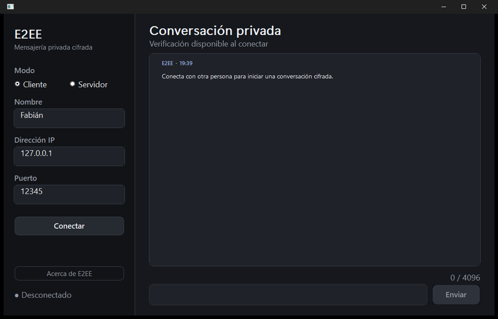
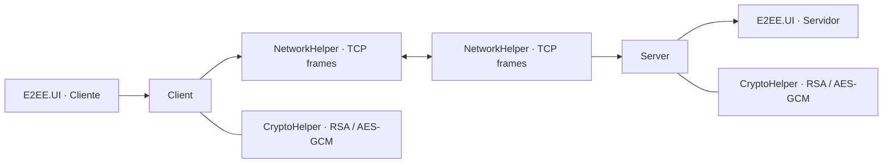

# E2EE Desktop

[](https://github.com/LathorTylla/E2EE/actions/workflows/windows-build.yml)


Aplicación de mensajería privada punto a punto para Windows, desarrollada en
C++17 con Win32, WinSock y OpenSSL. Incluye una interfaz nativa, protocolo TCP
enmarcado, cifrado autenticado, verificación visual de sesión y pruebas reales
cliente-servidor.



## Lo más importante

- Aplicación de escritorio nativa, adaptable y compatible con DPI alto.
- Modos cliente y servidor dentro del mismo ejecutable visual.
- Mensajes bidireccionales y recepción asíncrona sin bloquear la interfaz.
- AES-256-GCM con nonce único: confidencialidad, integridad y autenticación de
  cada paquete.
- RSA-3072 con OAEP-SHA-256 para transportar la clave efímera de sesión.
- Código de seguridad compartido para verificar la identidad por otro canal.
- Perfil del contacto, timestamps, indicador de escritura, contador y reconexión.
- Frames TCP con límite de tamaño y manejo correcto de envíos/recepciones parciales.
- Dependencias reproducibles mediante un manifiesto de vcpkg.
- Compilación y pruebas automáticas en Windows mediante GitHub Actions.

## Arquitectura



El handshake negocia la versión `E2EE/2`, intercambia claves públicas y envía
la clave AES cifrada con RSA-OAEP. Después se intercambian los perfiles y todos
los eventos de chat viajan dentro de paquetes AES-GCM autenticados.

## Compilar en Visual Studio

Requisitos:

- Windows 10 u 11 de 64 bits.
- Visual Studio 2022 o posterior.
- Carga de trabajo **Desarrollo para el escritorio con C++**.
- Integración de vcpkg incluida en Visual Studio.

Pasos:

1. Abre `E2EE/E2EE.sln`.
2. Selecciona `Release | x64` o `Debug | x64`.
3. Acepta la restauración de vcpkg si Visual Studio la solicita.
4. Haz clic derecho en `E2EE.UI` y elige **Establecer como proyecto de inicio**.
5. Compila con `Ctrl + Shift + B` y ejecuta con `F5`.

Los ejecutables quedan en `E2EE/bin/x64/`:

- `E2EE.UI.exe`: aplicación visual recomendada.
- `E2EE.exe`: cliente/servidor de consola para diagnóstico.
- `E2EE.Tests.exe`: pruebas automáticas.

## Probar dos participantes

En la misma computadora:

1. Abre dos instancias de `E2EE.UI.exe`.
2. En la primera selecciona **Servidor**, escribe un nombre, conserva el puerto
   `12345` y pulsa **Conectar**.
3. En la segunda selecciona **Cliente**, usa `127.0.0.1`, el mismo puerto y pulsa
   **Conectar**.
4. Comprueba que ambas ventanas muestran el mismo código de seguridad.
5. Envía mensajes en ambos sentidos con **Enter** o **Enviar**.
6. Desconecta una instancia y vuelve a conectar para verificar la recuperación.

Entre dos computadoras de la misma red, el servidor debe permitir la aplicación
en el Firewall de Windows y el cliente debe usar la IPv4 local del servidor, por
ejemplo `192.168.1.25`. Ambas instancias deben utilizar el mismo puerto.

## Pruebas

Desde Visual Studio, compila `E2EE.Tests` y ejecútalo sin depuración. También
puedes usar una terminal en `E2EE/bin/x64/`:

```powershell
.\E2EE.Tests.exe
```

Las suites comprueban:

- Intercambio RSA-OAEP de una clave AES de 256 bits.
- Round-trip de texto vacío, Unicode y mensajes grandes.
- Rechazo de ciphertext manipulado mediante el tag de GCM.
- Coincidencia del código de seguridad entre los participantes.
- Handshake TCP real en localhost, perfiles, escritura y mensajes en ambos sentidos.
- Cierre limpio de sockets e hilos de recepción.

## Modelo y límites de seguridad

Este proyecto demuestra prácticas criptográficas modernas, pero no pretende
reemplazar una aplicación auditada como Signal.

- La identidad queda verificada únicamente si ambas personas comparan el código
  de seguridad mediante un canal confiable; sin esa comparación existe riesgo de
  intermediario durante el primer contacto.
- Las claves de identidad no son persistentes y se regeneran en cada ejecución.
- El protocolo actual no proporciona *forward secrecy*.
- La conexión es TCP directa: no hay cuentas, relay, descubrimiento, NAT traversal
  ni almacenamiento de mensajes.
- El proyecto no ha recibido una auditoría criptográfica independiente.

Estas restricciones están documentadas deliberadamente y constituyen la hoja de
ruta natural para una versión futura.

## Estructura

```text
E2EE/
├── include/              Interfaces de red, criptografía, cliente y servidor
├── src/                  Implementación y aplicación Win32
├── tests/                Pruebas criptográficas y de integración TCP
├── assets/               Icono y captura de la aplicación
├── resources/            Recursos nativos de Windows
├── E2EE.UI.vcxproj       Aplicación visual
├── E2EE.vcxproj          Aplicación de consola
├── E2EE.Tests.vcxproj    Pruebas automáticas
└── vcpkg.json            Dependencias reproducibles
```

## Descripción breve para CV

> Diseñé una aplicación de mensajería privada en C++17 para Windows con interfaz
> Win32, sockets TCP asíncronos y cifrado autenticado AES-256-GCM. Implementé un
> handshake RSA-3072/OAEP-SHA-256, framing resistente a I/O parcial, verificación
> de identidad de sesión, pruebas cliente-servidor y CI reproducible con vcpkg.

## Autor y créditos

Desarrollado por **Fabián Israel Murillo García**.

Agradecimiento a **Roberto Charreton Kaplun** por su guía durante la etapa inicial
del proyecto. Distribuido bajo la licencia incluida en [LICENSE](LICENSE).
